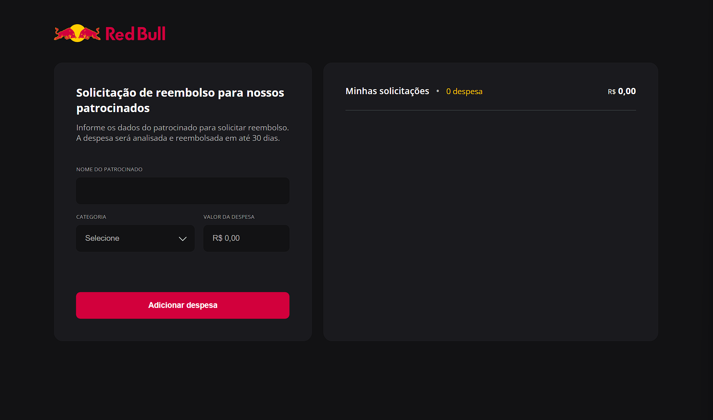

# RedBull Sponsored Reimbursement Form

Esta aplicação é um formulário de reembolso desenvolvido para o processo seletivo de Engenheiro Front-End Sênior na RedBull. Foi criada para testar os conhecimentos nos fundamentos da criação de layout utilizando apenas HTML, CSS e JavaScript, sem o uso de frameworks.

  

## Projeto

A aplicação permite que patrocinados da RedBull solicitem reembolsos de despesas. O usuário pode adicionar o nome do patrocinado, a categoria da despesa e o valor. As despesas adicionadas aparecem em um checkout ao lado, listando todas as solicitações de reembolso.

## Funcionalidades

- **Adicionar Despesa**: Formulário para inserir o nome do patrocinado, categoria da despesa e valor.
- **Solicitação de Despesa**: Exibição das despesas adicionadas em um checkout ao lado.

## 🚀 Tecnologias

Esse projeto foi desenvolvido com as seguintes tecnologias:

- HTML
- CSS
- JavaScript

Desenvolvido com 💚 por [Renato Khael](https://renatokhael.dev)
